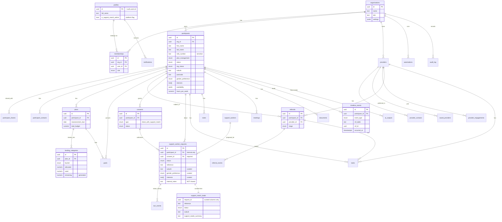

# Coordinator OS — Entity Relationship Diagram

Everything connects to the **participant** and writes to the **timeline**.

## Privacy boundary (the critical line)

`support_worker_requests` holds **both** an internal link to `participants` **and** a
curated snapshot of matching-only fields. Support Match Admin reads **only** the
`support_match_leads` view (via a security-definer RPC), which exposes the curated
columns and never `participant_id`, `internal_notes`, NDIS number, plans, notes, or
any clinical table.
